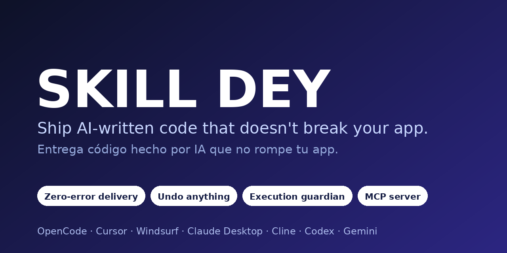
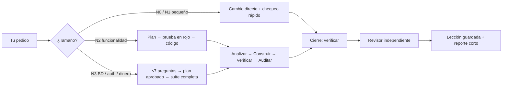

<div align="center">



# 🚀 SKILL DEY

### Entrega código hecho por IA que no rompe tu app.

Un marco de calidad agéntico para el desarrollo asistido por IA: entiende lo que pides, construye **sin romper** lo que ya funciona y no entrega nada con **errores**. Pruebas, seguridad, documentación y ahorro de tokens vienen incluidos.

[](LICENSE.md)
[](#-instalación-rápida)
[](https://opencode.ai)
[](https://modelcontextprotocol.io/)
[](#-funciona-con-tu-ia)

[English](README.md) · **Español**

</div>

---

## ¿Por qué SKILL DEY?

Las IA escriben código rápido, pero también rompen lo que funcionaba, filtran secretos, se saltan pruebas y dicen "listo" cuando no lo está. SKILL DEY pone un **ciclo de calidad y un guardián** alrededor de tu IA para que "funciona" signifique *verificado*, no *afirmado*.

| | Qué obtienes |
|---|---|
| ✅ **Entrega sin errores** | Una tarea solo se cierra tras verificar: revisión de todo el proyecto, auditoría de seguridad, probador automático, formato, rendimiento (N+1) y validación en el servidor. |
| 🛟 **Deshacer todo** | Foto automática antes de cada pedido. Escribe *"deshaz"* y tus archivos vuelven, incluso en cambios pequeños. Nunca toca tus ramas ni tu historial. |
| 🛡️ **Guardián de ejecución** | Bloquea secretos en el código, leer `.env`, `git push --force`, commits sin verificar, `.env` subido a git, migraciones de BD sin respaldo, código truncado (`// ...resto del código`) y escrituras fuera del proyecto. |
| 🧠 **Memoria técnica persistente** | Decisiones, lecciones y reglas de negocio viven en `.skill_dey/` (`BITACORA`, `DECISIONES`, `LECCIONES`, `NEGOCIO`, `ESTADO`, `MARCA`) y el contexto sobrevive entre sesiones. |
| 🤖 **Multi-agente** | Un agente principal, un **explorador** de solo lectura para búsquedas grandes, un agente de **visión** que convierte maquetas/capturas en UI y un **revisor independiente** que audita lo que no escribió. |
| 📉 **Cuida los tokens** | Las tareas pequeñas no cargan la skill; los flujos pesados solo cuando hacen falta. Un tablero muestra tokens, costo y tiempo por respuesta. |
| 🔌 **Servidor MCP incluido** | Expone las revisiones como herramientas nativas para cualquier cliente MCP. |

---

## 🧭 Cómo funciona



- **La verificación es código, no opinión.** "Funciona" significa verificador en verde, no que el modelo lo diga.
- **Los fallos repetidos escalan.** Tres verificaciones en rojo seguidas activan un ciclo de *diagnóstico sistemático*; la siguiente activa el freno (deshacer y reportar).
- **¿App que ya existe?** El *modo adopción* hace copia de seguridad, revisa todo el código, levanta back + front, audita seguridad y lógica de negocio, y escribe un informe priorizado en `.skill_dey/ADOPCION.md`. Corrige solo lo roto o de alto riesgo y **te pregunta antes de tocar la lógica de negocio**.

---

## ⚡ Instalación rápida

**Requisitos:** [OpenCode](https://opencode.ai) (`npm i -g opencode-ai`) para la experiencia completa. Se recomienda [Git](https://git-scm.com/), y [Node.js](https://nodejs.org/) (20+) es necesario para el CLI y el servidor MCP. Los instaladores usan PowerShell (Windows) o bash (macOS/Linux) si no tienes Node.

```bash
git clone https://github.com/IngDey/SKILL-DEY-Enterprise-Agentic-Framework-AI-Development-Suite.git
cd SKILL-DEY-Enterprise-Agentic-Framework-AI-Development-Suite
```

¿Sin Git? Descarga el `.zip` desde [Releases](../../releases) y descomprímelo.

| Sistema | Qué hacer |
|---|---|
| **Windows** | Doble clic en `INSTALAR.bat` |
| **macOS** | Doble clic en `INSTALAR.command` (si macOS lo bloquea: `bash INSTALAR.command` en Terminal) |
| **Linux** | `bash INSTALAR.command` |

Luego **reinicia OpenCode** y escribe normal. Reinstalar es seguro: actualiza todo y **conserva lo aprendido**.

<details>
<summary><b>🔍 ¿Qué cambia exactamente el instalador? (clic para ver)</b></summary>

No hay nada oculto. El instalador:

1. Copia la skill, los agentes, comandos, herramientas y el plugin guardián en `~/.config/opencode/` (o `$OPENCODE_CONFIG_DIR`).
2. Actualiza tu `opencode.json`: pone `default_agent` en `skill_dey` y activa la compactación de contexto. Antes guarda una copia `.bak`.
3. Agrega sus reglas globales a `AGENTS.md` dentro de bloques `SKILL_DEY` claramente marcados.
4. Registra el servidor MCP en **Cursor, Windsurf, Claude Desktop y Cline** *solo si están instalados*. Respalda cada configuración como `*.antes-skill_dey.bak` y solo agrega o actualiza su entrada `skill_dey`.
5. Detecta las capacidades de tus modelos y te avisa si falta `git`, `opencode` o `python`, con el comando de instalación para tu sistema.

En Windows, el instalador sin Node ejecuta PowerShell con `-ExecutionPolicy Bypass` solo para ese script. Puedes leerlo antes en [`app/instalador/`](app/instalador/).
</details>

### Comprueba que funciona

- En OpenCode pregunta: **"¿skill_dey está funcionando?"**. Además se autodiagnostica sus 8 protecciones cada vez que abres OpenCode y solo te avisa si algo falla.
- O desde cualquier terminal:

```bash
node ~/.config/opencode/skill_dey/skill_dey.mjs revisar .
```

---

## 💬 Cómo se usa

No necesitas comandos. Escribe normal: *"agrega el campo responsable a tickets"*, *"revisa que el sitio no tenga errores"*, *"documenta la app"*.

| Escribe | Qué pasa (casi todo por código, casi sin tokens) |
|---|---|
| `iniciar skill dey` / `finalizar skill dey` | Enciende / apaga SKILL DEY (recuerda el estado) |
| `revisa que no haya errores` | Recorre **todas las páginas**, detecta 404/500, errores de consola, recursos que no cargan, enlaces rotos, errores PHP/SQL visibles y `undefined`/`NaN`; corrige la causa raíz y repite hasta quedar limpio |
| `revisa la seguridad` / `prueba la app` | Auditoría de seguridad + probador automático (datos válidos, obligatorios, ataques SQL/XSS, acceso sin sesión), incluso en formularios dibujados por JavaScript (React/SPA) |
| `documenta la app` | Regenera `docs/MANUAL-TECNICO.md`, `DICCIONARIO-DATOS.md`, `MANUAL-USUARIO.md`, `database/instalacion.sql` y los PDF |
| `deshaz` | Restaura la foto tomada antes de tu último pedido (se puede rehacer) |
| `/skill_dey ayuda` | Lista todos los comandos en 6 grupos |

---

## 🌐 Funciona con tu IA

| Herramienta | Cómo |
|---|---|
| **OpenCode** | Experiencia completa: guardián en vivo, fotos automáticas, cambio de modelo, tablero de consumo |
| **Cursor · Windsurf · Claude Desktop · Cline** | Servidor MCP registrado por el instalador + reglas del proyecto |
| **Claude Code · Codex · Gemini CLI · Copilot · Zed · Firebase Studio** | Reglas del proyecto (comando `multi-ia`) + chequeos por CLI |

```bash
# Escribe las reglas que cada IA lee sola (AGENTS.md, CLAUDE.md, GEMINI.md,
# .cursorrules, .windsurfrules, copilot-instructions.md, .clinerules, ...)
node ~/.config/opencode/skill_dey/skill_dey.mjs multi-ia .

# CLI universal (cualquier IA con terminal)
node ~/.config/opencode/skill_dey/skill_dey.mjs revisar|seguridad|pruebas|capacitar|movil|organizar|documentar|validar|produccion [carpeta] [url]
```

Configuración MCP manual (cualquier cliente):

```json
{
  "mcpServers": {
    "skill_dey": {
      "command": "node",
      "args": ["/Users/TU_USUARIO/.config/opencode/skill_dey/skill_dey-mcp.mjs"]
    }
  }
}
```

Herramientas MCP: `skill_dey_revisar`, `skill_dey_seguridad`, `skill_dey_pruebas`, `skill_dey_capacitar`, `skill_dey_organizar`, `skill_dey_documentar`, `skill_dey_validar`, `skill_dey_produccion`, `skill_dey_movil`.

> **Nota honesta:** el guardián *en vivo* (fotos automáticas, bloqueo de comandos peligrosos, verificación al cerrar, cambio de modelo, tablero de consumo) es un plugin de OpenCode y solo corre ahí. En otras IAs tienes las reglas más los chequeos deterministas (CLI/MCP), que cubren la mayor parte del valor. Mira [`app/global/MULTI-IA.md`](app/global/MULTI-IA.md).

---

## 🧪 Probado, con evidencia

El repo incluye un registro público con **135 pruebas documentadas** (instaladores, deshacer/rehacer, bloqueos del guardián, rastreador del sitio, probador de seguridad, generación de documentación, cambio de modelo y más), con los errores que se encontraron y corrigieron: [`docs/PRUEBAS-REALIZADAS.md`](docs/PRUEBAS-REALIZADAS.md).

También trae un [banco de 10 casos](app/skills/skill-dey/evals/BANCO-DE-PRUEBAS.md) y un comparador (`evals/comparar.mjs`) para medir SKILL DEY contra la IA directa **con tu propio modelo**.

Límites conocidos, dichos con claridad: la lógica de Windows y macOS se validó con PowerShell 7 y rutas multiplataforma, aún no en equipos físicos, y la calidad de las decisiones depende del modelo que uses. Los reportes de tu entorno son muy bienvenidos.

---

## 📁 Estructura del repositorio

```
INSTALAR.bat / INSTALAR.command   instaladores de un clic
app/                              todo lo que se instala
  skills/skill-dey/               la skill: enrutador, niveles, ciclo, referencias, plantillas de memoria
  agents/                         principal, explorador, revisor, visión
  plugins/skill_dey-guardian.ts   el guardián de ejecución
  tools/ · skill_dey-lib/         verificación, impacto, deshacer, seguridad, probador, motor de docs
  mcp/ · cli/                     servidor MCP y CLI universal
  instalador/                     instaladores (Node, PowerShell, bash) y registrador MCP
docs/                             guía de instalación y registro de pruebas
```

---

## 🤝 Contribuir

Ideas, reportes de errores y PRs son bienvenidos. Mira [CONTRIBUTING.md](CONTRIBUTING.md). Si SKILL DEY salvó tu proyecto, una ⭐ ayuda a que otros desarrolladores lo encuentren.

## 📄 Licencia

[MIT](LICENSE.md) © 2026 IngDey
