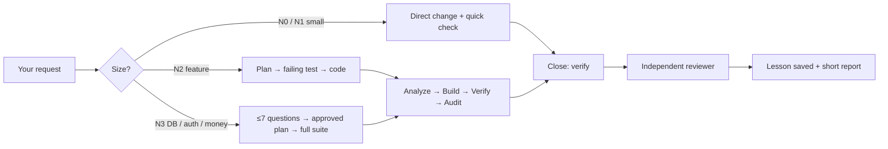

<div align="center">


# 🚀 SKILL DEY

### Ship AI-written code that doesn't break your app.

An agentic quality framework for AI-assisted development: it understands what you ask, builds **without breaking** what already works, and refuses to hand back anything with **errors**. Tests, security, documentation and token savings come built in.

[](LICENSE.md)
[](#-quick-install)
[](https://opencode.ai)
[](https://modelcontextprotocol.io/)
[](#-works-with-your-ai)

**English** · [Español](README.es.md)

</div>

---

## Why SKILL DEY?

AI assistants write code fast, and they also break working features, leak secrets, skip tests and say "done" when it isn't. SKILL DEY puts a **quality loop and a guardian** around your AI so "it works" means *verified*, not *claimed*.

| | What you get |
|---|---|
| ✅ **Zero-error delivery** | A task only closes after verification: whole-project review, security audit, automatic tester, formatting, N+1 performance check and server-side validation. |
| 🛟 **Undo anything** | An automatic snapshot before every request. Say *"deshaz"* (undo) and your files are back, even for small changes. It never touches your branches or history. |
| 🛡️ **Execution guardian** | Blocks secrets in code, reading `.env`, `git push --force`, commits that weren't verified, `.env` going to git, DB migrations without a backup, truncated code (`// ...rest of the code`) and writes outside your project. |
| 🧠 **Persistent project memory** | Decisions, lessons and business rules live in `.skill_dey/` (`BITACORA`, `DECISIONES`, `LECCIONES`, `NEGOCIO`, `ESTADO`, `MARCA`) so context survives across sessions. |
| 🤖 **Multi-agent** | A main agent, a read-only **explorer** for big searches, a **vision** agent that turns mockups/screenshots into UI, and an **independent reviewer** that audits changes it didn't write. |
| 📉 **Token-aware** | Small tasks don't load the skill; heavy workflows load only when needed. A usage board shows tokens, cost and time per answer. |
| 🔌 **MCP server included** | Exposes the checks as native tools to any MCP client. |

---

## 🧭 How it works



- **Verification is code, not opinion.** "Works" means the verifier is green, not that the model said so.
- **Repeated failures escalate.** Three red checks in a row trigger a *systematic diagnosis* cycle; the next one triggers a brake (undo and report).
- **Existing app?** *Adoption mode* backs it up, reviews all code, boots back + front, audits security and business logic, and writes a prioritized report to `.skill_dey/ADOPCION.md`. It fixes only what is broken or high-risk and **asks before touching business logic**.

---

## ⚡ Quick install

**Requirements:** [OpenCode](https://opencode.ai) (`npm i -g opencode-ai`) for the full experience. [Git](https://git-scm.com/) is recommended, and [Node.js](https://nodejs.org/) (20+) is needed for the CLI and MCP server. The installers themselves fall back to PowerShell (Windows) or bash (macOS/Linux) if Node isn't installed.

```bash
git clone https://github.com/IngDey/SKILL-DEY-Enterprise-Agentic-Framework-AI-Development-Suite.git
cd SKILL-DEY-Enterprise-Agentic-Framework-AI-Development-Suite
```

No Git? Download the `.zip` from [Releases](../../releases) and unzip it.

| System | Run |
|---|---|
| **Windows** | Double-click `INSTALAR.bat` |
| **macOS** | Double-click `INSTALAR.command` (if macOS blocks it: `bash INSTALAR.command` in Terminal) |
| **Linux** | `bash INSTALAR.command` |

Then **restart OpenCode** and just write normally. Reinstalling is safe: it updates everything and **keeps what was learned**.

<details>
<summary><b>🔍 What exactly does the installer change? (click to expand)</b></summary>

Nothing is hidden. The installer:

1. Copies the skill, agents, commands, tools and guardian plugin into `~/.config/opencode/` (or `$OPENCODE_CONFIG_DIR`).
2. Updates your `opencode.json`: sets `default_agent` to `skill_dey` and enables context compaction. It saves a `.bak` copy first.
3. Appends its global rules to `AGENTS.md` inside clearly marked `SKILL_DEY` blocks.
4. Registers the MCP server in **Cursor, Windsurf, Claude Desktop and Cline** *only if they're installed*. It backs up each config as `*.antes-skill_dey.bak` and only adds/updates its own `skill_dey` entry.
5. Detects the capabilities of your available models and tells you if `git`, `opencode` or `python` are missing, with the install command for your OS.

On Windows, the no-Node fallback runs PowerShell with `-ExecutionPolicy Bypass` for that single script only. Read it in [`app/instalador/`](app/instalador/) before running if you like.
</details>

### Verify it works

- In OpenCode ask: **"¿skill_dey está funcionando?"** (is skill_dey working?). It also self-checks its 8 protections each time OpenCode opens and only warns you if something fails.
- Or from any terminal:

```bash
node ~/.config/opencode/skill_dey/skill_dey.mjs revisar .
```

---

## 💬 Using it

You don't need commands. Write normally: *"add the field `owner` to tickets"*, *"check the site has no errors"*, *"document the app"*.

| Say | What happens (mostly by code, almost no tokens) |
|---|---|
| `iniciar skill dey` / `finalizar skill dey` | Turn SKILL DEY on / off (state is remembered) |
| `revisa que no haya errores` | Crawls **every page**, detects 404/500, console errors, failing assets, broken links, visible PHP/SQL errors, `undefined`/`NaN`; fixes root causes and repeats until clean |
| `revisa la seguridad` / `prueba la app` | Security audit + automatic tester (valid data, required fields, SQL/XSS attacks, access without session), including forms rendered by JavaScript (React/SPA) |
| `documenta la app` | Regenerates `docs/MANUAL-TECNICO.md`, `DICCIONARIO-DATOS.md`, `MANUAL-USUARIO.md`, `database/instalacion.sql` and PDFs |
| `deshaz` | Restores the snapshot taken before your last request (redo available) |
| `/skill_dey ayuda` | Lists every command in 6 groups |

---

## 🌐 Works with your AI

| Tool | How |
|---|---|
| **OpenCode** | Full experience: live guardian, automatic snapshots, model fallback, usage board |
| **Cursor · Windsurf · Claude Desktop · Cline** | MCP server auto-registered by the installer + project rules |
| **Claude Code · Codex · Gemini CLI · Copilot · Zed · Firebase Studio** | Project rules (`multi-ia` command) + CLI checks |

```bash
# Write the rules each AI reads natively (AGENTS.md, CLAUDE.md, GEMINI.md,
# .cursorrules, .windsurfrules, copilot-instructions.md, .clinerules, ...)
node ~/.config/opencode/skill_dey/skill_dey.mjs multi-ia .

# Universal CLI (any AI with a terminal)
node ~/.config/opencode/skill_dey/skill_dey.mjs revisar|seguridad|pruebas|capacitar|movil|organizar|documentar|validar|produccion [folder] [url]
```

Manual MCP config (any client):

```json
{
  "mcpServers": {
    "skill_dey": {
      "command": "node",
      "args": ["/Users/YOUR_USER/.config/opencode/skill_dey/skill_dey-mcp.mjs"]
    }
  }
}
```

MCP tools: `skill_dey_revisar`, `skill_dey_seguridad`, `skill_dey_pruebas`, `skill_dey_capacitar`, `skill_dey_organizar`, `skill_dey_documentar`, `skill_dey_validar`, `skill_dey_produccion`, `skill_dey_movil`.

> **Honest note:** the *live* guardian (automatic snapshots, blocking dangerous commands, verification on close, model switching, usage board) is an OpenCode plugin and only runs there. In other AIs you get the rules plus the deterministic checks (CLI/MCP), which cover most of the value. See [`app/global/MULTI-IA.md`](app/global/MULTI-IA.md).

---

## 🧪 Tested, with receipts

The repo ships a public test log with **135 documented checks** (installers, undo/redo, guardian blocks, site crawler, security tester, docs generation, model fallback and more), including the bugs found and fixed along the way: [`docs/PRUEBAS-REALIZADAS.md`](docs/PRUEBAS-REALIZADAS.md).

It also includes a [10-case benchmark](app/skills/skill-dey/evals/BANCO-DE-PRUEBAS.md) and a comparer (`evals/comparar.mjs`) so you can measure SKILL DEY against the plain AI **with your own model**.

Known limits, stated plainly: Windows and macOS logic was validated with PowerShell 7 and cross-platform paths, not on physical machines yet, and decision quality depends on the model you use. Reports from your setup are very welcome.

---

## 📁 Repository layout

```
INSTALAR.bat / INSTALAR.command   one-click installers
app/                              everything that gets installed
  skills/skill-dey/               the skill: router, levels, cycle, references, memory templates
  agents/                         main, explorer, reviewer, vision
  plugins/skill_dey-guardian.ts   the execution guardian
  tools/ · skill_dey-lib/         verification, impact, undo, security, tester, docs engine
  mcp/ · cli/                     MCP server and universal CLI
  instalador/                     installers (Node, PowerShell, bash) and MCP registrar
docs/                             install guide and test log
```

---

## 🤝 Contributing

Ideas, bug reports and PRs are welcome. See [CONTRIBUTING.md](CONTRIBUTING.md). If SKILL DEY saved your project, a ⭐ helps other developers find it.

## 📄 License

[MIT](LICENSE.md) © 2026 IngDey
